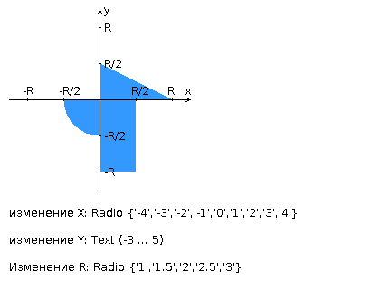

# Web Программирование. Лабораторная работа №1

**Вариант:** 465029
## Задание

Разработать FastCGI сервер на языке Java, определяющий попадание точки на координатной плоскости в заданную область, и создать HTML-страницу, которая формирует данные для отправки их на обработку этому серверу.

Параметр R и координаты точки должны передаваться серверу посредством HTTP-запроса. Сервер должен выполнять валидацию данных и возвращать HTML-страницу с таблицей, содержащей полученные параметры и результат вычислений - факт попадания или непопадания точки в область (допускается в ответе сервера возвращать json строку, вместо html-страницы). Предыдущие результаты должны сохраняться между запросами и отображаться в таблице.

Кроме того, ответ должен содержать данные о текущем времени и времени работы скрипта.

### Комментарии по выполнению ЛР

- Требуется поднять Apache httpd веб-сервер от лица своего пользователя на гелиосе (шаблон файла конфигурации доступен для скачивания наверху страницы)
- Веб-сервер должен заниматься обслуживанием статического контента (html, css, js) и перенаправлять запросы за динамическим контентом к FastCGI серверу
- FastCGI сервер требуется реализовать на языке Java (полезная библиотека в помощь в виде jar архива доступна для скачивания наверху страницы) и поднять также на гелиосе
- Путем обращений из JavaScript к FastCGI серверу требуется показать понимание принципа AJAX

### Требования к HTML-странице

Разработанная HTML-страница должна удовлетворять следующим требованиям:

- Для расположения текстовых и графических элементов необходимо использовать блочную верстку.
- Данные формы должны передаваться на обработку посредством POST-запроса.
- Таблицы стилей должны располагаться в отдельных файлах.
- При работе с CSS должно быть продемонстрировано использование селекторов элементов, селекторов потомств, селекторов псевдоклассов, селекторов псевдоэлементов а также такие свойства стилей CSS, как наследование и каскадирование.
- HTML-страница должна иметь "шапку", содержащую ФИО студента, номер группы и новер варианта. При оформлении шапки необходимо явным образом задать шрифт (sans-serif), его цвет и размер в каскадной таблице стилей.
- Отступы элементов ввода должны задаваться в пикселях.
- Страница должна содержать сценарий на языке JavaScript, осуществляющий валидацию значений, вводимых пользователем в поля формы. Любые некорректные значения (например, буквы в координатах точки или отрицательный радиус) должны блокироваться.  
  
## Как запускать?

### Локальная разработка

1. **Собрать jar-файл:**
   ```powershell
   .\gradlew jar
   ```
   Результат будет находиться в `build/libs/app.jar`.

2. **Запустить Java-приложение локально:**
   ```powershell
   java -jar -DFCGI_PORT=12346 build/libs/app.jar
   ```
   Приложение начнёт слушать на порту 12346.

### Развёртывание на Helios

1. **Собрать jar-файл:**
   ```powershell
   .\gradlew jar
   ```
2. **Скопировать файлы на сервер Helios:**
   - Скопировать `build/libs/app.jar` в `~/httpd-root/fcgi-java/`
   - Скопировать содержимое папки `www/` в `~/httpd-root/www/` или соответствующую папку для статических файлов
3. **Пробросить порт (создать туннель):**
   ```powershell
   ssh -p 2222 s465029@helios.cs.ifmo.ru -L 12345:localhost:12345
   ```
   Оставить туннель открытым во время работы.
4. **Перезапустить Apache HTTP Server:**
   ```powershell
   httpd -f ~/httpd-root/httpd.conf -k restart
   ```

5. **Запустить Java-приложение на сервере:**
   ```powershell
   java -jar -DFCGI_PORT=12346 ~/httpd-root/fcgi-java/app.jar
   ```

6. **Открыть страницу в браузере:**
   ```
   http://localhost:12345/
   ```

---
