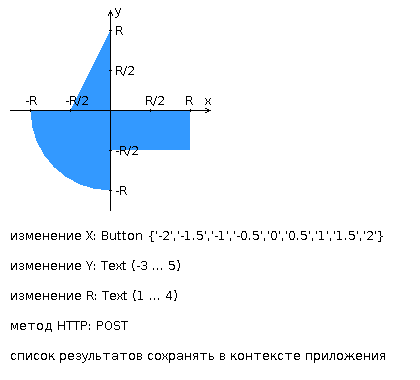

# Web Программирование. Лабораторная работа №2
**Вариант** 8484

## Задание

Разработать веб-приложение на базе сервлетов и JSP, определяющее попадание точки на координатной плоскости в заданную область.

Приложение должно быть реализовано в соответствии с шаблоном MVC и состоять из следующих элементов:

- **ControllerServlet**, определяющий тип запроса, и, в зависимости от того, содержит ли запрос информацию о координатах точки и радиусе, делегирующий его обработку одному из перечисленных ниже компонентов. Все запросы внутри приложения должны передаваться этому сервлету (по методу GET или POST в зависимости от варианта задания), остальные сервлеты с веб-страниц напрямую вызываться не должны.
- **AreaCheckServlet**, осуществляющий проверку попадания точки в область на координатной плоскости и формирующий HTML-страницу с результатами проверки. Должен обрабатывать все запросы, содержащие сведения о координатах точки и радиусе области.
- **Страница JSP**, формирующая HTML-страницу с веб-формой. Должна обрабатывать все запросы, не содержащие сведений о координатах точки и радиусе области.

### Требования к разработанной странице JSP

Разработанная страница JSP должна содержать:

- "Шапку", содержащую ФИО студента, номер группы и номер варианта.
- Форму, отправляющую данные на сервер.
- Набор полей для задания координат точки и радиуса области в соответствии с вариантом задания.
- Сценарий на языке JavaScript, осуществляющий валидацию значений, вводимых пользователем в поля формы.
- Интерактивный элемент, содержащий изображение области на координатной плоскости (в соответствии с вариантом задания) и реализующий следующую функциональность:
  - Если радиус области установлен, клик курсором мыши по изображению должен обрабатываться JavaScript-функцией, определяющей координаты точки, по которой кликнул пользователь и отправляющей полученные координаты на сервер для проверки факта попадания.
  - В противном случае, после клика по картинке должно выводиться сообщение о невозможности определения координат точки.
  - После проверки факта попадания точки в область изображение должно быть обновлено с учётом результатов этой проверки (т.е., на нём должна появиться новая точка).
- Таблицу с результатами предыдущих проверок. Список результатов должен браться из контекста приложения, HTTP-сессии или Bean-компонента в зависимости от варианта.

### Требования к странице, возвращаемой AreaCheckServlet

Страница, возвращаемая AreaCheckServlet, должна содержать:

- Таблицу, содержащую полученные параметры.
- Результат вычислений - факт попадания или непопадания точки в область.
- Ссылку на страницу с веб-формой для формирования нового запроса.

### Комментарии по выполнению

Разработанное веб-приложение необходимо развернуть на сервере WildFly. Сервер должен быть запущен в standalone-конфигурации, порты должны быть настроены в соответствии с выданным portbase, доступ к http listener'у должен быть открыт для всех IP.


## Запуск приложения

### Способ 1: Использование скрипта (Windows)
```batch
restart.bat
```

> **Внимание**: Отредактируйте путь к папке `build` в `restart.bat` на свой путь перед запуском.

### Способ 2: Ручная сборка
```bash
# Сборка WAR файла
./gradlew clean war

# Сборка Docker образа
docker build -t my-wildfly-app .

# Запуск контейнера
docker run -d -p 8080:8080 -p 9990:9990 --name my-wildfly-container my-wildfly-app
```

### Способ 3: Sборка и запуск на локальном WildFly
1. Установите WildFly
2. Выполните `./gradlew war`
3. Скопируйте `build/libs/app.war` в папку `$WILDFLY_HOME/standalone/deployments/`
4. Запустите WildFly: `$WILDFLY_HOME/bin/standalone.sh` (Linux) или `bin\standalone.bat` (Windows)

### Доступ к приложению
После запуска приложение доступно по адресу: **http://localhost:8080/app**