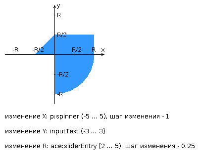

# Web Программирование. Лабораторная работа №3
**Вариант** 9484
>**Примечание** также в этом проекте выполнял задание по ОПИ (3 и 4 лабы)
## Задание

Разработать приложение на базе JavaServer Faces Framework, которое осуществляет проверку попадания точки в заданную область на координатной плоскости.

Приложение должно включать в себя 2 facelets-шаблона - стартовую страницу и основную страницу приложения, а также набор управляемых бинов (managed beans), реализующих логику на стороне сервера.

### Требования к стартовой странице

Стартовая страница должна содержать следующие элементы:

- "Шапку", содержащую ФИО студента, номер группы и номер варианта.
- Интерактивные часы, показывающие текущие дату и время, обновляющиеся раз в 6 секунд.
- Ссылку, позволяющую перейти на основную страницу приложения.

### Требования к основной странице приложения

Основная страница приложения должна содержать следующие элементы:

- Набор компонентов для задания координат точки и радиуса области в соответствии с вариантом задания. Может потребоваться использование дополнительных библиотек компонентов - ICEfaces (префикс "ace") и PrimeFaces (префикс "p"). Если компонент допускает ввод заведомо некорректных данных (таких, например, как буквы в координатах точки или отрицательный радиус), то приложение должно осуществлять их валидацию.
- Динамически обновляемую картинку, изображающую область на координатной плоскости в соответствии с номером варианта и точки, координаты которых были заданы пользователем. Клик по картинке должен инициировать сценарий, осуществляющий определение координат новой точки и отправку их на сервер для проверки её попадания в область. Цвет точек должен зависить от факта попадания / непопадания в область. Смена радиуса также должна инициировать перерисовку картинки.
- Таблицу со списком результатов предыдущих проверок.
- Ссылку, позволяющую вернуться на стартовую страницу.

### Дополнительные требования к приложению

- Все результаты проверки должны сохраняться в базе данных под управлением СУБД HSQLDB.
- Для доступа к БД необходимо использовать JPA с ORM-провайдером на усмотрение студента.
- Для управления списком результатов должен использоваться Application-scoped Managed Bean.
- Конфигурация управляемых бинов должна быть задана с помощью параметров в конфигурационном файле.
- Правила навигации между страницами приложения должны быть заданы в отдельном конфигурационном файле.  

## Как запускать?

### 1. Настройка базы данных
Создайте БД и пользователя в PostgreSQL:
```sql
CREATE DATABASE lab3;
CREATE USER lab3_user WITH ENCRYPTED PASSWORD 'lab3_pass';
GRANT ALL PRIVILEGES ON DATABASE lab3 TO lab3_user;
```

### 2. Настройка DataSource в сервере
**WildFly** (`standalone.xml`):
```xml
<datasource jndi-name="java:/Web3DS" pool-name="Web3DS" enabled="true" use-java-context="true">
    <connection-url>jdbc:postgresql://localhost:5432/lab3</connection-url>
    <driver>postgresql</driver>
    <security>
        <user-name>lab3_user</user-name>
        <password>lab3_pass</password>
    </security>
</datasource>
```

### 3. Сборка
```bash
./gradlew war
```
WAR-файл появится в `build/libs/lab_3.war`

### 4. Деплой
- **WildFly**: скопируйте WAR в `standalone/deployments/` или через Management Console
### 5. Запуск
Запустите сервер приложений и откройте: `http://localhost:8080/lab_3/` (контекст может отличаться)

### Тесты
```bash
./gradlew test
```
